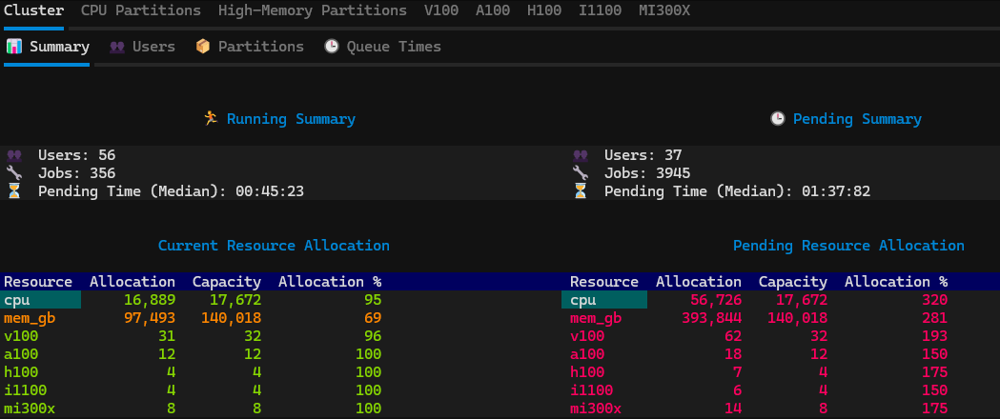

# HPC Queue Analyser


A queue monitoring and analysis tool for [SLURM](https://slurm.schedmd.com/overview.html)-based HPC clusters, designed to help system administrators track resource allocation and proactively manage queues. 



> ⚠️ **Disclaimer**  
This project is currently under active development. Features may change, and bugs may be present. Use at your own discretion, and feel free to report issues or contribute!

## Features

- **Summary statistics:**
    View active users, total jobs, and queue lengths at a glance.
- **Resource allocation:**
    Monitor CPU, memory, and GPU allocation across the cluster, both in absolute terms and as percentages of capacity. 
- **Data slicing:**
    Slice metrics by partition, user, and job state to help identify root causes of queuing issues.
- **Interactive TUI:**
    Navigate a responsive terminal interface built with [Textual](https://github.com/Textualize/textual), offering structured and intuitive data exploration.
- **Customizable reports:**
    Define custom reporting groups via a simple YAML configuration file


## Installation

### Prerequisites

The HPC Queue Analyser requires a compatible version of Python (developed using Python 3.12.4) and an HPC system with the usual SLURM command-line tools (`squeue`, `sinfo`, `sacct`).

> ⚠️ This tool has currently only been tested with Python 3.12.4. Compatibility with other versions is not guaranteed.

### Steps


To install the HPC Queue Analyser, clone the repository and install the required dependencies (pandas, textual, pyyaml):

```bash
git clone https://github.com/stevencousens/hpc-queue-analyser.git
cd hpc-queue-analyser

# load Python into your environment (if applicable, this is cluster specific)
module load apps/python3/3.12.4/gcc-14.1.0

# create and activate a virtual environment for Python packages (recommended)
python3 -m venv .venv 
source .venv/bin/activate

# install required Python packages
pip install -r requirements.txt
```

## Getting started

To launch the Queue Analyser TUI, run the following command while in the root of the project directory and with your Python environment activated.

```bash
python3 main.py
```

For printing only top-level summaries to the terminal, a `--cli` option can also be used.

```bash
python3 main.py --cli
```

### Navigating the TUI

- **Switch between tabs**: ← / → arrow keys, or click with the mouse  
- **Move focus between panels**: Tab / Shift+Tab, or click with the mouse  
- **Quit the application**: q or Ctrl+Q

### Customizing Queue Reports

The HPC Queue Analyser supports customization of reports via a YAML configuration file. Users can define named `analysis_groups` that contain:

- `name`: A unique identifier for the analysis group
- `criteria`: A set of filter conditions to apply to the report

By defining an analysis group, a new tab will be created in the report corresponding to `name` which displays queue and capacity data filtered by the set `criteria`. The criteria generally appear as lists of strings. 

Supported criteria keys:

- `partitions`
- `nodes`
- `gpu_types`
- `users`
- `custom_queue_mask`
- `custom_capacity_mask`


#### Example 1: Filtering by partitions

On Kelvin2 the main CPU nodes can be accessed via either of the four partitions k2-epsrc, k2-hipri, k2-medpri, k2-lowpri so it makes sense to group these together in the analysis. This would be done by setting the `partitions` in the criteria as follows:

```yaml
analysis_groups:

  - name: cpu_partitions
    criteria:
      partitions: ["k2-epsrc", "k2-hipri", "k2-medpri", "k2-lowpri"]
```

#### Example 2: Filtering by gpu type

As an alternative to filtering by partition, it can also be useful to group jobs that use the same GPU type. This can be achieved as follows:

```yaml
  - name: v100
    criteria:
        gpu_types: ["v100"]
```


## Testing

There are currently only a limited number of tests, but will be added to as the project grows. These can be run using pytest from the project root directory

```bash
$ pytest -v
```


## License

This project is licensed under the MIT License. See [LICENSE](./LICENSE) for details.

## Contributing

Contributions are welcome! Feel free to open issues or submit pull requests.
